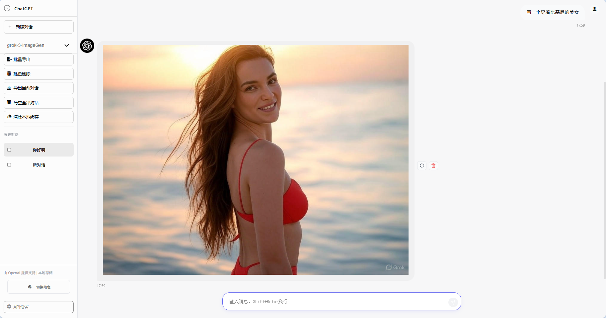

# ChatGPT 多模型前端 Demo

## 项目简介

本项目是一个纯前端实现、支持多模型切换的 ChatGPT 聊天 Demo。界面美观，功能丰富，适合个人和开发者本地部署与使用。所有数据均存储于本地浏览器，无需后端数据库，保护用户隐私。

**项目包含两个版本：**
- **Demo 版本**：简洁实用的基础版本，功能完备
- **ChatGPT 版本**：现代化升级版，增加高级特性与视觉效果

---

## 主要功能

### 基础功能（两版本通用）

- **多模型支持**：可自定义接入多种 AI 模型，灵活切换
- **对话管理**：多会话历史、批量删除、批量导出、单条消息编辑/删除/重生成
- **本地存储**：所有对话和设置均存储于本地浏览器，数据安全可控
- **主题切换**：亮/暗主题一键切换，界面自适应移动端和桌面端
- **代码高亮与复制**：内置 highlight.js，支持代码高亮和一键复制
- **API配置界面**：可视化配置 API 地址、Key 及模型列表，支持一键清除、恢复默认、测试API
- **图片放大**：支持图片消息点击放大预览

### ChatGPT 版本增强功能

- **📎 文件附加**：支持上传并附加文件到对话中（图片、文档等）
- **🎨 AI 生图模式**：一键切换至图像生成模式
- **🧠 深度思考模式**：启用 AI 推理链展示，查看模型思考过程
- **💬 会话提示词**：为每个会话设置独立的系统提示词
- **✨ 视觉特效**：
  - 鼠标拖尾效果
  - 点击烟花特效
  - 消息时间戳显示
  - 可调节特效强度（0-100%）
- **🎯 现代化 UI**：参考官方 ChatGPT 界面设计，体验更流畅
- **📝 Markdown 渲染**：使用 marked.js 完整支持 Markdown 格式
- **🔄 流式响应优化**：更平滑的打字机效果，思考过程实时展示

---

## 使用方法

### Demo 版本

1. **下载项目**
   - 克隆或下载本项目到本地
2. **本地打开**
   - 直接用浏览器打开 `Demo/Demo.html` 文件即可使用
3. **API配置**
   - 点击侧边栏底部的"API设置"按钮，填写 API 地址、Key 及模型列表（可参考下方示例）
   - 支持一键清除、恢复默认、测试API连通性

### ChatGPT 版本

1. **下载项目**
   - 克隆或下载本项目到本地
2. **本地打开**
   - 直接用浏览器打开 `ChatGPT/index.html` 文件即可使用
3. **API配置**
   - 点击右上角齿轮图标进入设置
   - 填写 API 地址、Key 及模型列表
   - 可选：配置会话提示词、启用特效
4. **高级功能**
   - 点击输入框左侧图标切换模式（附件/生图/思考）
   - 在设置中调整视觉特效强度
   - 为每个会话设置独立的系统提示词

### API配置示例

```
base_url: https://api.op414.com/v1/chat/completions
API_KEY: sk-xxxxx
模型列表：
（可根据实际模型填写）

- gpt-4o
- gpt-4o-mini
- o3-mini
```

---

## 版本对比

| 功能特性 | Demo 版本 | ChatGPT 版本 |
|---------|----------|-------------|
| 多模型切换 | ✅ | ✅ |
| 对话历史管理 | ✅ | ✅ |
| 批量操作 | ✅ | ✅ |
| 代码高亮 | ✅ | ✅ |
| 主题切换 | ✅ | ✅ |
| 文件附加 | ❌ | ✅ |
| AI 生图模式 | ❌ | ✅ |
| 深度思考展示 | ❌ | ✅ |
| 会话提示词 | ❌ | ✅ |
| 视觉特效 | ❌ | ✅ |
| Markdown 完整支持 | ❌ | ✅ |
**选择建议：**
- 追求简洁稳定 → 选择 **Demo 版本**
- 需要高级功能 → 选择 **ChatGPT 版本**

---

## 依赖说明

### Demo 版本
- [highlight.js](https://highlightjs.org/) - 代码高亮
- [FontAwesome](https://fontawesome.com/) - 图标库

### ChatGPT 版本
- [highlight.js](https://highlightjs.org/) - 代码高亮
- [marked.js](https://marked.js.org/) - Markdown 解析
- 自定义字体：猫啃珠圆体

---

## 预览效果

### ChatGPT 版本


### Demo 版本




---

## 技术特性

### 数据存储
- 使用 localStorage 实现完全本地化存储
- 无需服务器，数据完全掌控
- 支持导入/导出对话历史

### API 兼容性
- 兼容 OpenAI API 格式
- 支持流式响应（SSE）
- 支持多模态内容（文本、图片（参考硅基流动的API文档）、推理链）

### 界面适配
- 响应式设计，支持桌面端和移动端
- 侧边栏折叠/展开
---

## 许可协议

本项目仅供学习与交流，禁止用于商业用途。 